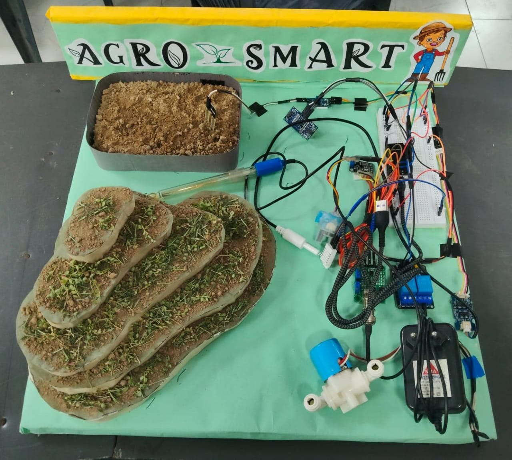
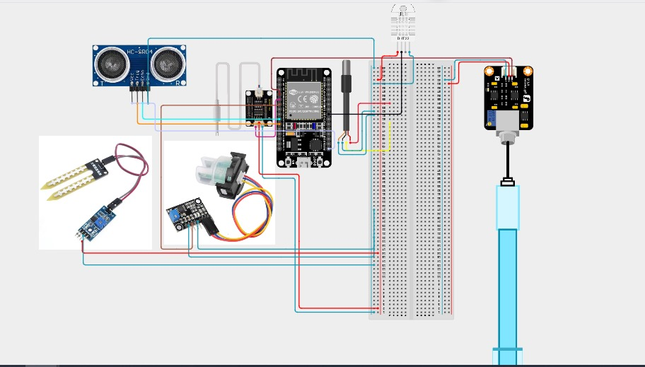

# 🌾 AGROSMART — IoT-Based Smart Irrigation System

🚀 Project for DEVIATHON 2025  
Theme: Internet of Things (IoT)  
Category: Hardware–Software Integrated Solution  
Team Name: AlphaStack  

---

## 🟩 Overview

AgroSmart is an ESP32-based IoT smart irrigation system designed to optimize water usage and improve agricultural productivity.

The system automates irrigation using real-time data from:

- Soil Moisture Sensor  
- Tank Water Level (Ultrasonic Sensor)  
- TDS Sensor (Water Quality – ppm)  
- Turbidity Sensor (Water Clarity)  

The system integrates hardware automation with cloud-based monitoring using the **Blynk IoT platform**.

---

## 🟩 Problem Statement

Farmers in regions like Jorethang, South Sikkim face:

- Unpredictable rainfall  
- Water scarcity  
- Manual irrigation dependency  
- Lack of affordable automation  

This leads to:
- Water wastage  
- Increased labor  
- Reduced crop yield  

---

## 🟩 Proposed Solution

AgroSmart provides:

- Automatic irrigation based on soil moisture threshold  
- Tank level monitoring to prevent dry pumping  
- Water quality monitoring using TDS and turbidity sensors  
- Real-time data visualization via Blynk dashboard  
- Remote manual pump control  
- Instant alert notifications  

---

## 🧩 System Architecture
# 🌾 AGROSMART — IoT-Based Smart Irrigation System

🚀 Project for DEVIATHON 2025  
Theme: Internet of Things (IoT)  
Category: Hardware–Software Integrated Solution  
Team Name: AlphaStack  

---

## 🟩 Overview

AgroSmart is an ESP32-based IoT smart irrigation system designed to optimize water usage and improve agricultural productivity.

The system automates irrigation using real-time data from:

- Soil Moisture Sensor  
- Tank Water Level (Ultrasonic Sensor)  
- TDS Sensor (Water Quality – ppm)  
- Turbidity Sensor (Water Clarity)  

The system integrates hardware automation with cloud-based monitoring using the **Blynk IoT platform**.

---

## 🟩 Problem Statement

Farmers in regions like Jorethang, South Sikkim face:

- Unpredictable rainfall  
- Water scarcity  
- Manual irrigation dependency  
- Lack of affordable automation  

This leads to:
- Water wastage  
- Increased labor  
- Reduced crop yield  

---

## 🟩 Proposed Solution

AgroSmart provides:

- Automatic irrigation based on soil moisture threshold  
- Tank level monitoring to prevent dry pumping  
- Water quality monitoring using TDS and turbidity sensors  
- Real-time data visualization via Blynk dashboard  
- Remote manual pump control  
- Instant alert notifications  

---

## 🧩 System Architecture

+---------------------------------------------------+
| SENSOR LAYER |
| Soil Moisture | TDS | Turbidity | Ultrasonic |
+--------------------------+------------------------+
|
v
+-------------+
| ESP32 |
| Control & |
| WiFi Module |
+------+------+
|
----------------------------------
| |
Relay Control Blynk Cloud
| |
Water Pump Mobile Dashboard

---

## ⚙️ Working Principle

1. Soil moisture is continuously monitored.
2. If soil moisture falls below threshold AND tank level is sufficient → Pump turns ON.
3. Pump turns OFF when moisture reaches required level or tank level becomes low.
4. Sensor data is transmitted to Blynk dashboard.
5. Farmer can manually control pump via mobile app.

---

## 📊 Blynk Dashboard Configuration

| Widget | Function |
|---------|----------|
| Gauge 1 | Soil moisture percentage |
| Gauge 2 | Tank water level (cm) |
| Gauge 3 | TDS value (ppm) |
| Gauge 4 | Turbidity (%) |
| Button | Manual pump control |
| Notification | Low tank / Poor water alerts |

---

## 🔧 Hardware Components

| Component | Function |
|------------|----------|
| ESP32 | Central control & WiFi communication |
| Soil Moisture Sensor | Detect soil water content |
| TDS Sensor | Measure dissolved solids (ppm) |
| Turbidity Sensor | Detect water clarity |
| Ultrasonic Sensor | Measure tank level |
| Relay Module | Pump switching & isolation |
| Submersible Pump | Automated irrigation |
| 5V Power Supply | System power source |

---

## 📸 Prototype Demonstration

### 🔹 Full System Setup

---

## 🧩 Circuit Design

---

## ⚙️ Implementation Notes

- Developed using ESP32 Dev Board with Wi-Fi communication.
- Soil moisture calibrated using dry and wet soil conditions.
- Relay module used for electrical isolation between ESP32 and pump.
- Ultrasonic sensor deployed for tank depth measurement.
- Sensor data transmitted to Blynk IoT cloud.
- Tested using real soil bed and live water circulation setup.

---

## 🧠 Control Logic
IF soil_moisture < threshold
AND tank_level > minimum_level
THEN pump = ON
ELSE pump = OFF

Threshold Parameters:
- Soil Moisture Threshold: 40%
- Minimum Tank Level: 12 cm
- TDS Threshold: 700 ppm
- Turbidity Threshold: 65%

---

## 🚧 Challenges Faced

- Noise in analog sensor readings
- Soil density affecting calibration accuracy
- WiFi reconnection stability
- Safe isolation of pump power circuit

---

## 📈 Future Improvements

- Moving average filtering for stable sensor readings
- MQTT-based communication for scalability
- PCB-based compact hardware design
- Solar-powered deployment
- Weather API integration for predictive irrigation
- Crop-specific moisture calibration

---

## 🌍 Impact

| Area | Outcome |
|------|----------|
| Water Conservation | Reduces wastage through threshold control |
| Productivity | Ensures consistent irrigation |
| Labor Efficiency | Minimizes manual supervision |
| Cost-effectiveness | Uses affordable open-source components |
| Sustainability | Promotes eco-friendly smart farming |

---

## 👩‍💻 Team AlphaStack

**Nency Chandiramani**  
Team Leader & IoT Developer  
- System design  
- ESP32 programming  
- Blynk integration  
- Control logic implementation  

Team Members: Hardware assembly, testing & documentation support.

---

## 🏁 Conclusion

AgroSmart presents a scalable, affordable, and practical smart agriculture solution.  

By combining IoT, automation, and real-time monitoring, it empowers farmers with data-driven irrigation control.

---

### ✨ Tagline

**“Every Drop Counts, Every Crop Matters — AgroSmart: Smarter Water, Better Harvest.”**

